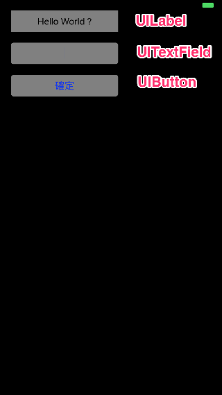
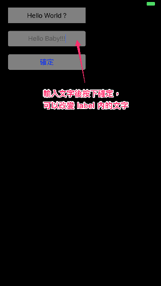
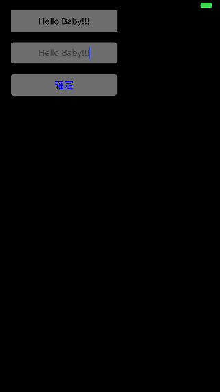

# Lesson 1 Basic ViewController


- swift 結尾沒有分號 ```;``` ，但你要加也可以。
- 請嘗試在 xcode 上建立一個 swift 的專案。
- ```import <UIKit/UIKit.h> 變成 import UIKit```
- property 的值可以設定為 optional ，類似 obj-c 的 nil ，但是他除了物件以外的一般變數都可以選擇 optional (沒有任何值）。
- 有可能（或是不曉得）此 property 是否有值，可以用 ? 的寫法，如下：

	```
	var testString : String? = "Hello" // 此句可以看成：testString 是 String，他可以是空的 ( nil 的 )
	testString = nil // it's ok
	
	```

- property 的寫法
	
	```
	// objective-c
	@property (nonatomic , strong) UIButtin *button
	
	// swift
	var button: UIButton!
	
	```
- property 中的 ? 以及 ! 的用法

	如果你確定你的 property 不可能會是 nil 值，那就直接用 ```!``` ，如下：
	
	```
	var button1: UIButton!
	
	```
	如果你確定你的 property 有可能會是 nil 值，那就直接用 ```?``` ，如下：
	
	```
	var button1: UIButton?
	
	```

- function 要用```func```開頭

	如：
	
	```
	func getStart()
	{
		print("Hello Baby!!");
	}
	```
	
- 覆寫要用```override```

	如：
	
	```
	override func viewDidLoad()
	{
		super.viewDidLoad();
	}
	```
- if else 不用 () 

	如：
	
	```
	if	x == nil {
	
	}
	
	```
	但是不能寫成
	
	```
	if	x {
	    // 這是編譯不過的，因為 if 之後一定要是判斷式
	}
	```
	
- switch case 沒有 break （ swifch case 的用法後面在補充，他有很多可擴充的用法 ）
	如：
	
	```
	let vegetable = "red pepper"
	switch vegetable {
		case "celery":
			let vegetableComment = "Add some raisins and make ants on a log."
		case "cucumber", "watercress":
			let vegetableComment = "That would make a good tea sandwich."
		case let x where x.hasSuffix("pepper"):
			let vegetableComment = "Is it a spicy \(x)?"
		default:
    		let vegetableComment = "Everything tastes good in soup."
}
	```
	
- swift 中取代 #pragma mark 的方法是用 // MARK: ，可參考[這篇文章](http://stackoverflow.com/questions/24017316/pragma-mark-in-swift)

# Lesson 1 作業

- 請建立一個有 UILabel , UITextField , UIButton 元件的畫面，並且自行設定位置。
- UITextField 可以輸入文字。
- UIButton 按下去後，可以改變 UILabel 的文字。
- 作業程式碼在 branch Lesson_1_HW1 , 可以切到該分支看程式碼。
-




